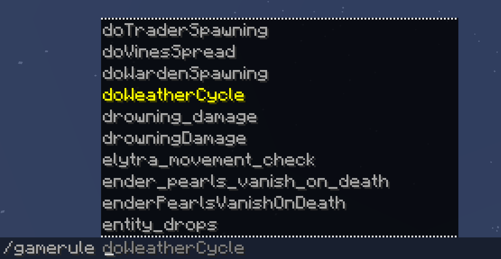

## Classic Gamerule

A simple mod that brings back the classic gamerule names to MC 1.21.11+

Minecraft renamed all gamerules from camelCase to namespaced:snake_case in [25w44a](https://www.minecraft.net/en-us/article/minecraft-snapshot-25w44a) (1.21.11 snapshot),
and even reverted the values of some rules, which broke all existing usage of gamerules.
This is a poorly implemented incompatible change. Let's "revert" it by restoring the old names in Minecraft.

For example, classic gamerules like `doDaylightCycle` were changed to `advance_time` (actually `minecraft:advance_time`), and `doMobSpawning` became `spawn_mobs`

## What This Mod Does

Functionalities:

1. Add all camelCase names as aliases for existing gamerules, e.g. `/gamerule doMobSpawning false` will work again now
2. Correctly mapped rule values that were inverted, e.g., `disableElytraMovementCheck` has the opposite value of `minecraft:elytra_movement_check`

Limitation:

1. This mod only restores the classic naming conventions and value mappings.
   It does not revert the newly added value constraints for certain gamerules (e.g. `minecraft:max_entity_cramming`)
2. Classic rule `doFireTick` and `allowFireTicksAwayFromPlayer` are read-only now.
   Since their successor `minecraft:fire_spread_radius_around_player` cannot perfectly express the intention of these 2 old rules 

## Requirement

This mod is server-side only (including single-player worlds) and requires no additional dependencies.
It supports all Minecraft versions since 1.21.11
